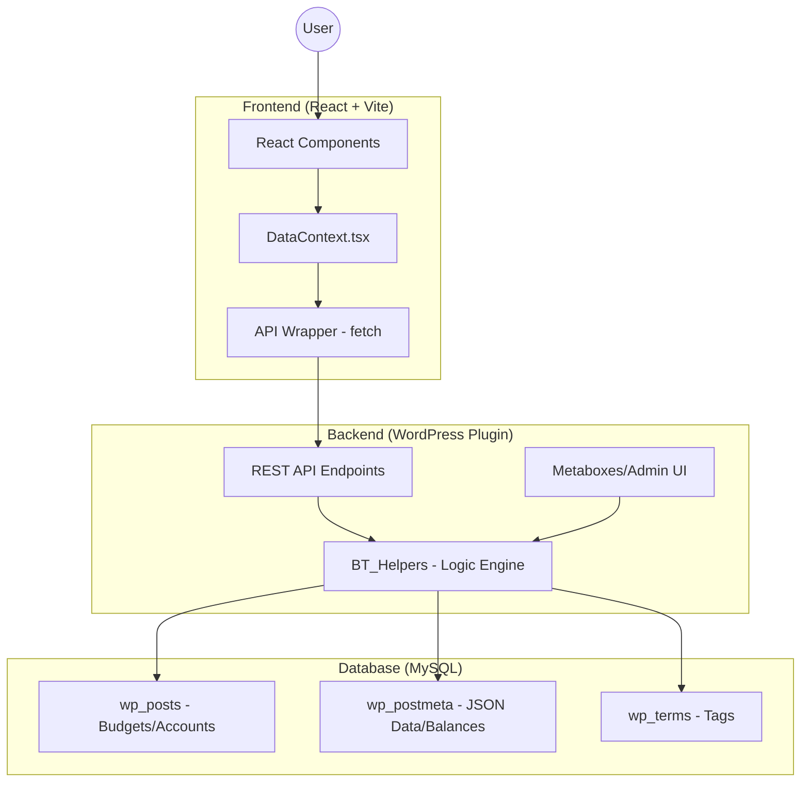
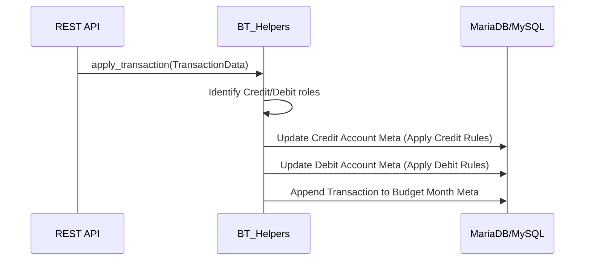

# Kaasu Project Architecture Documentation

This document provides a detailed overview of the Kaasu budget tracker's architecture, including its technology stack, database schema, API design, and the implementation of its Double-Entry (Credit/Debit) transaction engine.

---

## 1. System Architecture

Kaasu uses a decoupled architecture where a **WordPress Plugin** acts as a headless CMS/Backend, and a **React (Vite)** application serves as the frontend.

---

## 2. Database Schema

The project leverages WordPress's flexible Custom Post Type (CPT) system. Instead of custom tables, it uses the standard `wp_posts` and `wp_postmeta` tables, which allows for easy backup, migration, and integration with the WordPress ecosystem.

### 2.1 Post Types
| Post Type | Entity | Purpose |
| :--- | :--- | :--- |
| `bt_monthly_budget` | **Budget Month** | Represents a specific month (e.g., "January 2025"). Acts as a container for all transactions in that period. |
| `bt_account` | **Financial Account** | Represents a Bank, Cash wallet, Loan, or Investment. Stores persistent balances. |

### 2.2 Meta Keys (The "Real" Data)
#### `bt_monthly_budget` Meta
| Key | Type | Description |
| :--- | :--- | :--- |
| `_bt_transactions` | `JSON Array` | A serialized array of transaction objects containing IDs, amounts, types, and account mappings. |
| `_bt_plans` | `JSON Array` | A serialized array of planned expenses for the month. |

#### `bt_account` Meta
| Key | Type | Description |
| :--- | :--- | :--- |
| `_bt_account_group` | `String` | Determines the accounting rules (`Cash`, `Loan`, `Saving`, `Investment`, `Insurance`). |
| `_bt_account_amount` | `Float` | The **Lifetime Balance** of the account. |
| `_bt_account_description` | `String` | Optional notes about the account. |

### 2.3 Taxonomies
*   **`bt_tag`**: Used for categorized tagging of transactions (stored using standard WordPress taxonomy tables).

---

## 3. Transaction Logic: Double-Entry (Credit/Debit)

The "Heart" of Kaasu is the logic that determines how a transaction affects an account balance. This is implemented in `BT_Helpers::apply_transaction_to_account`.

### 3.1 Account Groups & Math Rules
Kaasu uses different rules based on whether an account is an **Asset** or a **Liability**.

| Account Group | Type | Debit Side (+) | Credit Side (-) |
| :--- | :--- | :--- | :--- |
| `Cash`, `Accounts`, `Saving` | **Asset** | Increases Balance | Decreases Balance |
| `Investment` | **Asset** | Increases Value | Decreases Value |
| `Loan`, `Insurance` | **Liability** | Decreases Debt ↓ | Increases Debt ↑ |

### 3.2 Transaction Mapping
When a transaction is saved, it is mapped to two sides:
1.  **Credit (Source)**: The money is leaving this account.
2.  **Debit (Destination)**: The money is entering this account.

**Logic Flow:**

---

## 4. API Endpoints

All communication between Frontend and Backend happens over the `kaasu-wp/v1` namespace.

### Endpoints Table
| Method | Endpoint | Description |
| :--- | :--- | :--- |
| `GET` | `/budgets` | List all monthly budget objects. |
| `GET` | `/budgets/{id}/summary` | Get aggregated totals for a specific month (Income, Expense, Net). |
| `GET` | `/accounts` | List all accounts with their lifetime balances. |
| `POST` | `/budgets/{id}/transactions` | Create a new transaction (automatically updates balances). |
| `PUT` | `/accounts/{id}` | Update account details or adjust starting balance. |

---

## 5. Frontend Architecture

The frontend is a modern React application optimized for mobile and web views.

*   **Vite**: The build tool ensuring fast HMR and optimized bundles.
*   **DataContext**: A central React Context provider that handles caching, invalidation, and global state for accounts, budgets, and tags.
*   **API Wrapper**: A thin abstraction layer using browser `fetch` to handle JSON serialization and authentication headers.

### Data Flow
1.  **Request**: Component calls `fetchBudgetDetails()` from `useData()`.
2.  **Network**: `DataContext` checks its local cache. If empty, it calls the `api.budgets.get()` wrapper.
3.  **Authentication**: The wrapper attaches the `Authorization: Bearer [Token]` header.
4.  **Response**: Data is stored in state and distributed to UI components.
